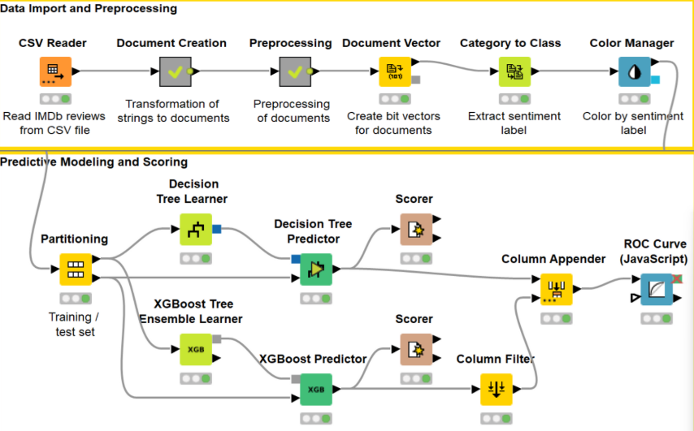

# 🎬 IMDB Sentiment Analysis using Decision Tree & XGBoost

## 📌 Project Overview
This project focuses on sentiment analysis of IMDB movie reviews using machine learning models in KNIME Analytics Platform.

The objective is to classify movie reviews into positive and negative sentiment categories and compare the performance of Decision Tree and XGBoost models.

## 🎯 Business Understanding
Internet Movie Database (IMDB) is one of the largest entertainment databases containing movie reviews and ratings.

This project aims to analyze public sentiment from movie reviews and transform textual feedback into useful insights that can support better user experience and recommendation systems.

## 🛠️ Tools & Technologies

  
  
  
  

## 📊 Dataset Information

- Source: IMDB Movie Reviews
- Total records: 2000 reviews
- Positive reviews: 1000
- Negative reviews: 1000

### Dataset Columns

| Column | Description |
|---|---|
| Index | Review ID |
| URL | IMDB review URL |
| Text | Movie review text |
| Sentiment | POS / NEG label |

## 🔄 Workflow Process

1. Data Import
2. Text Preprocessing
3. Feature Engineering
4. Sentiment Classification
5. Model Evaluation
6. Result Analysis

## 🧹 Data Preparation

The preprocessing stage includes:
- filtering unnecessary data
- text preprocessing
- document vector creation
- category conversion
- feature transformation

The workflow was developed using KNIME Analytics Platform.

## 🤖 Machine Learning Models

### 🌳 Decision Tree
- Good interpretability
- Easier to understand prediction logic

### ⚡ XGBoost
- Better predictive performance
- More optimized boosting algorithm

## 📈 Evaluation Results

### Decision Tree

| Metric | Value |
|---|---|
| TP | 277 |
| TN | 271 |
| FP | 23 |
| FN | 29 |

### XGBoost

| Metric | Value |
|---|---|
| TP | 288 |
| TN | 264 |
| FP | 12 |
| FN | 36 |

## 💡 Key Insights

- XGBoost achieved stronger predictive performance.
- Decision Tree provided better interpretability.
- Sentiment analysis can help improve movie recommendation systems.
- Review classification can support user experience optimization.

## 🚀 Business Recommendations

- Highlight movies with dominant positive sentiment as fan favorites.
- Monitor extreme negative reviews for quality evaluation.
- Improve recommendation systems based on sentiment patterns.

## 🖼️ Workflow Preview

  

